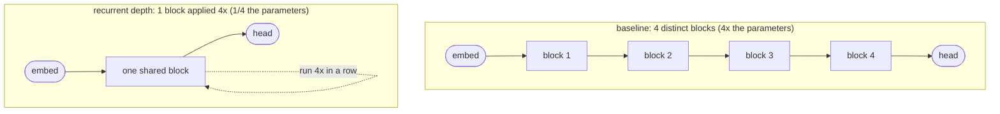
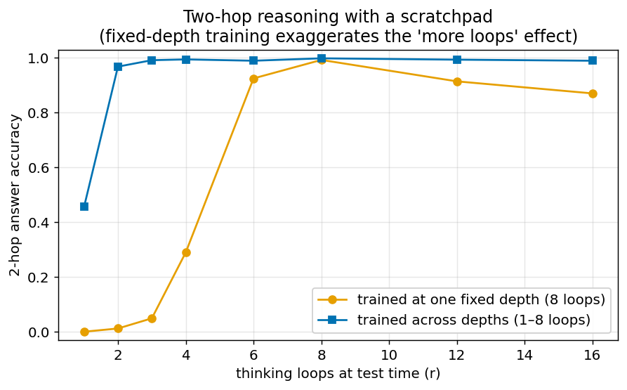
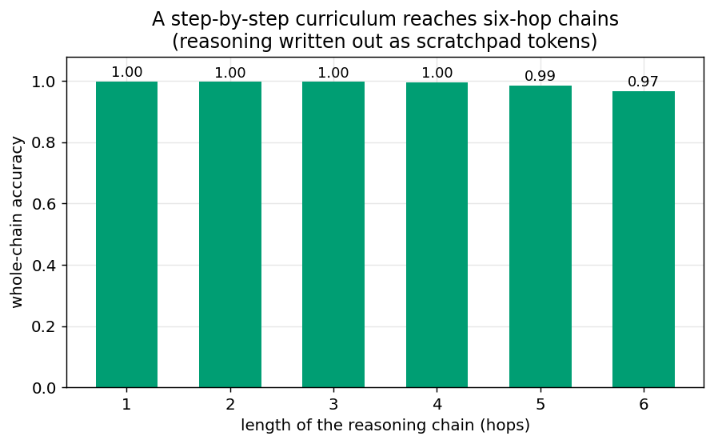
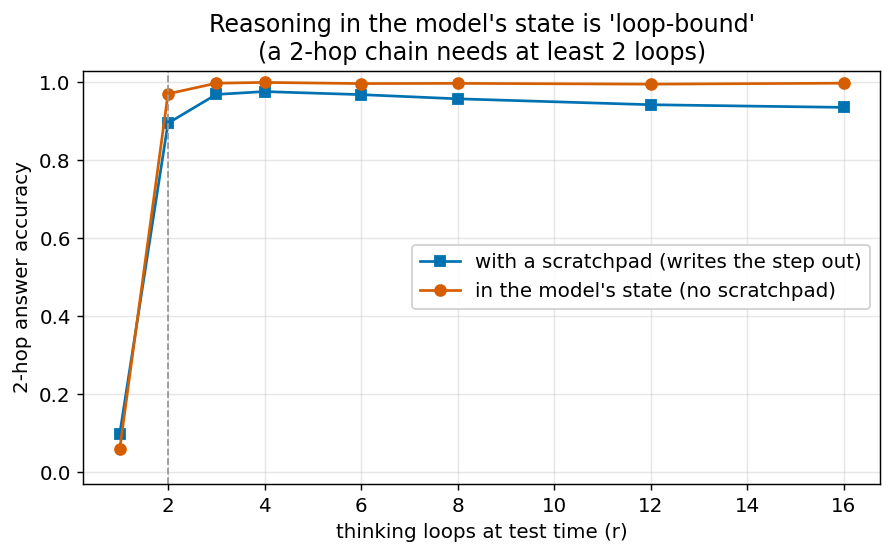
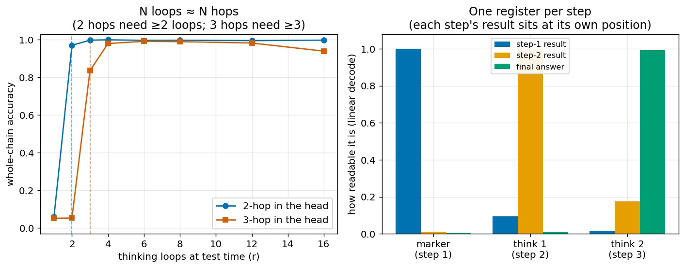
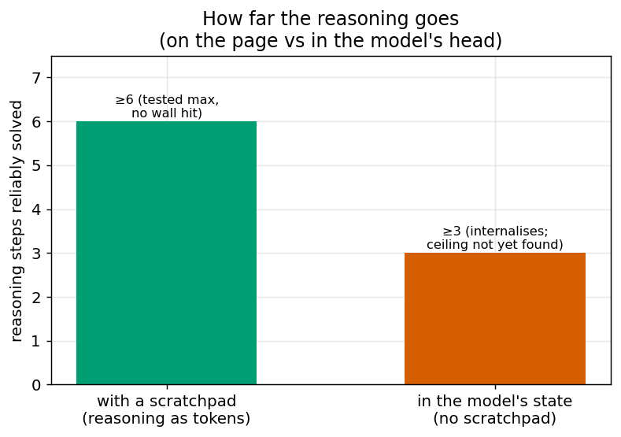

# Recurrent-depth Mamba

Can you make a small state-space model cheaper by *reusing* a layer instead of
stacking more of them?

That is the whole question here. The usual way to make a model deeper is to add
more layers, each with its own weights. But there is an old trick from the
transformer world (Universal Transformers, Looped Transformers): keep *one*
layer and just run it several times in a row. Same depth of computation, a
fraction of the parameters. I wanted to know whether that trick works on
**Mamba**, a state-space model, where as far as I could find it had not been
tried.

Short version: it works, with an honest asterisk. On an easy task you get about
**3.3× fewer parameters for roughly a quarter more training**. On a harder task
you can halve the parameters at *no* speed penalty, but you pay for it in
**reliability** instead. This README is the plain-language walkthrough; the code
is the technical version.

A second set of experiments (["does thinking longer buy reasoning?"](#a-different-question-does-thinking-longer-buy-reasoning),
further down) asks a different question of the same looped model. Because it reuses
one block, at test time you can run that block *more times than it was trained with*, so it can "think longer." Does that extra thinking let it solve harder problems? The
short answer: it can be taught real multi-step reasoning. Written down step by step it
reaches at least six steps; done **in its head** (no written steps) each step costs
one extra "thinking" loop, so an *N*-step chain needs *N* loops, and the intermediate
results turn out to be stashed one-per-position inside the model. (An earlier version of
this page reported in-head reasoning topping out at ~2 steps; that was a training-schedule
bug, now fixed; it internalises a 3-step chain cleanly.)

## What "recurrent depth" means

A normal 4-layer model looks like this: `block1 -> block2 -> block3 -> block4`,
four sets of weights. A recurrent-depth model reuses blocks: for example one
block applied four times, `block1 -> block1 -> block1 -> block1`. The
forward pass is just as deep (four steps of computation), but there is only one
set of weights to store and train, so it is about a quarter of the size.



*Same depth of computation either way. The only difference is how many distinct
sets of weights you pay for.*

I test five configurations, written as `(distinct blocks) x (times each is
applied)`:

| name | structure | what it probes |
|---|---|---|
| `baseline_4` | 4 blocks, each once | the normal 4-layer model (the reference) |
| `rd_1x4` | 1 block, applied 4× | maximum sharing: quarter the parameters, same depth |
| `rd_2x2` | 2 blocks, each 2× | the halfway point: half the parameters |
| `rd_4x2` | 4 blocks, each 2× | same parameters as baseline but double the compute |
| `rd_1x8` | 1 block, applied 8× | minimum parameters, maximum compute |

The last two exist to answer a specific question: is it the *parameters* that
matter, or the *amount of computation*? They add compute without adding
parameters, so if compute were the lever, they would help.

## Why it matters

If knowledge can be pushed out of a model's weights (which a companion repo,
[ssm-retrieval-efficiency](https://github.com/thevoidwolf/ssm-retrieval-efficiency),
argues for by showing retrieval is far cheaper than in-context recall), then the
model's core can be smaller. Recurrent depth is a second, independent lever on
the same goal: get the depth of a bigger model out of a smaller one. For anyone
training on a single GPU rather than a cluster, "same result, a third of the
parameters" is the difference between a plan that fits and one that does not. The
catch, below, is that the saving is not free, and being honest about the price is
the point of this repo.

## The task

A tiny model (256-wide Mamba-2 blocks, ~1.9M parameters at baseline) is trained
on a synthetic lookup task. Two versions:

- **inject** (easy): the one needed fact is placed right before the question. The
  model just has to copy the answer. Converges in tens of steps.
- **long** (harder): K facts are laid out inline and the model must stream them
  all, then answer a query about one of them (associative recall). Converges in
  thousands of steps, so it is a fairer stress test.

I measure one thing: **how many training steps it takes to reach 95% accuracy**
on fresh held-out samples (`step_to_95`). Fewer is better. All arms are run
across multiple random seeds, and I report every seed, because the seed spread
turns out to be the whole story on the hard task.

## Result 1: the easy task (inject)

Five arms, 3 seeds each, 300 steps. Every arm reaches 100% accuracy; the
question is only *how fast*.

| arm | params | step_to_95 (per seed) | mean | vs baseline |
|---|---:|---|---:|---|
| `baseline_4` | 1,863,008 | 45, 45, 45 | 45 | reference |
| `rd_2x2` | 998,960 | 50, 50, 50 | 50 | 1.9× fewer params, ~11% slower |
| `rd_1x4` | 566,936 | 55, 55, 60 | 57 | **3.3× fewer params, ~27% slower** |
| `rd_4x2` | 1,863,008 | 45, 45, 45 | 45 | same params, 2× compute: no change |
| `rd_1x8` | 566,936 | 60, 55, 60 | 58 | same params as rd_1x4, 2× compute: no change |

Two things fall out of this:

1. **The headline trade.** One block applied four times (`rd_1x4`) has 3.3×
   fewer parameters than the four-block baseline and learns the task in about a
   quarter more steps (57 vs 45). Parameters interpolate cleanly: the halfway
   arm (`rd_2x2`, half the parameters) sits neatly in the middle at 50 steps.
2. **Compute is not the lever, parameters are.** `rd_4x2` has the *same*
   parameter count as the baseline but does twice the computation, and it matches
   the baseline exactly (45). `rd_1x8` doubles the compute of `rd_1x4` at the
   same parameter count and gets nothing for it (58 vs 57). Extra passes over a
   fixed set of weights buy you nothing. **What you pay for is the parameters.**

## Result 2: the hard task (long), and the honest walk-back

This is where it gets interesting, and where an early version of this result was
too optimistic. On the long associative-recall task, 3 arms, 5 seeds each, 8000
steps:

| arm | params | step_to_95 (5 seeds) | converged | mean of converged |
|---|---:|---|:---:|---:|
| `baseline_4` | 1,863,008 | 5500, 3600, 3900, 3900, 6900 | **5/5** | 4760 |
| `rd_2x2` | 998,960 | 3800, 4200, n/c, 4900, n/c | **3/5** | 4300 |
| `rd_1x4` | 566,936 | 5300, n/c, 4100, n/c, 7900 | **3/5** | 5767 |

("n/c" means the arm never reached 95% accuracy within the 8000-step budget. The
two `rd_1x4` misses stalled near 0.41, barely above the noise floor; the two
`rd_2x2` misses got much closer, to 0.93 and 0.82.)

Here is the correction worth flagging, and it falls straight out of these five
seeds. **If you only looked at the first two seeds, `rd_2x2` looks like a free
lunch:** seeds 0 and 1 converge in 3800 and 4200 steps (mean 4000), *beating* the
baseline's first two seeds (5500 and 3600, mean 4550). Half the parameters and
faster. That is exactly the read an early two-seed check gave, and it is wrong.

The full five seeds dissolve it:

- On the seeds that converge, `rd_2x2` is within seed noise of the baseline (mean
  4300 vs 4760, if anything nominally faster). So there is **no real speed
  penalty at half the parameters**, but there is no free speed-up either. The
  two-seed sample had just caught the fast end of a wide spread.
- The real cost is reliability. At half the parameters, **2 of 5 seeds fail to
  reach 95%** within the budget (they top out at 0.93 and 0.82). The
  maximum-sharing `rd_1x4` arm (a quarter of the parameters) is worse still: also
  3/5, and its two failures collapse almost to chance (~0.41), not just short of
  the line.

So the honest claim is: **you can roughly halve the parameters at parity
convergence speed, but you take on a real reliability cost, on the order of two
seeds in five failing to converge here.** In practice that means pairing weight
sharing with a multi-seed protocol (train a few, keep the one that converges),
which eats back part of the saving. It is still a lever worth having, just not a
free one, and "it is actually faster" was a two-seed mirage I would rather show
than bury.

## A different question: does thinking longer buy reasoning?

Everything above is about *parameters*: can you shrink the model. A looped model has
a second knob the baseline does not: at test time you can run the shared block **more
times than it was trained with**. It can "think longer." The obvious question is
whether thinking longer lets it solve *harder* problems, or whether it just tolerates
the extra loops.

To answer that you need a task that actually gets harder with more reasoning. A
one-fact lookup does not: it is one step no matter what. So this second set of
experiments moves to **multi-hop chains**: instead of "X's value is 5", the model
gets a chain like "X points to Y, Y points to Z, Z's value is 5" and has to follow
it. A 2-hop chain needs two steps; a 6-hop chain needs six. Now "more reasoning"
means something measurable.

*(Every plot below is read straight from the run outputs. The fully technical
write-up, every number, control, and caveat, is in
[`docs/multihop-scaling-findings.md`](docs/multihop-scaling-findings.md).)*

### Thinking longer, or just tolerating it?

First, a warning that shaped everything after. If you train the loop at a *single*
fixed depth and then test it at other depths, you get a beautiful curve: accuracy
climbs steeply as you add loops. It looks like "more thinking → more reasoning."

It is mostly an illusion. A model trained only at 8 loops does not know how to run at
1 or 2 loops; the low end fails from unfamiliarity, not from a lack of computation.
Train the *same* model across a range of depths and the curve mostly flattens: the
2-hop task needs only about two loops, and the dramatic ramp was train/test mismatch.



The lesson (which I got wrong once and had to walk back): **a rising
accuracy-vs-loops curve from a fixed-depth model overstates real scaling; always
confirm with a model trained across depths.**

### Multi-hop reasoning is surprisingly hard to *learn*

Getting a small model to follow even a 2-hop chain is harder than it sounds. Trained
naively (just show it the chain and ask for the final answer), it never learns. It
settles into a shortcut: guess *some* value that appears in the problem, which is
right often enough to lower the loss but is not reasoning. The reason is subtle:
predicting only the final answer gives the model no signal about the **middle** step,
so it never builds one.

The fix is the same one that works for large models: let it **write its work down**.
When the model is trained to emit the intermediate step ("…so the middle thing is
Y…") before the final answer (a scratchpad, or "chain of thought"), it learns the
chain cleanly. The written intermediate is what finally gives the middle of the chain
something to learn from.

A side result worth noting: giving each hop its *own* dedicated block is **worse**
than reusing one shared block for all of them, on both robustness and on actually
learning the composition. Sharing wins here, which is the whole spirit of the repo.

### With a scratchpad, it reaches six-hop chains

Once the scratchpad is in place, how deep can it go? Trained cold on a 3-hop chain it
still stalls: the hops have to be learned one after another, and three at once is too
much. But trained as a **curriculum** (master 1 hop, then 2, then 3, each building on
the last), it climbs smoothly to **six-hop chains** with no wall in sight, and each
new hop is learned faster than the one before.



Accuracy drifts down gently with length (each hop is about 99% right, and six of them
compound to ~95%), but there is no cliff. The catch: with a scratchpad the reasoning
happens **on the page** (each step is a written token), so running more *internal*
loops is not what is doing the work. Depth here is bought by writing more steps,
cheaply.

### Reasoning "in its head": how it works, and how far it goes

The more interesting question for a small model is whether it can do the chain
*without* writing every step, carrying the intermediates inside itself across the
loops, the way you might add two numbers in your head. This is where the extra loops
should finally matter.

To get there I **weaned** the model off the scratchpad: start with the written steps,
then gradually replace each one with a blank "think" token that carries no
information but still gives the model a step in which to compute. Done gradually, it
works for a 2-hop chain: the model solves it entirely internally.

And now the extra loops genuinely matter. With the step no longer written down, the
2-hop chain **needs at least two loops**: one loop fails (stuck at the shortcut
floor), two loops solve it. This is the real "thinking longer buys reasoning" result,
and it only appears once the reasoning is internal.



**A false wall, and what fixing it revealed.** A 3-hop chain at first refused to go
internal, which looked like a hard ceiling at ~2 steps. It was not: it was a bug in
*how* I weaned. The schedule pushed all the way to the hardest (fully-internal) version
and stopped rehearsing the easier ones, so the model quietly *forgot* the scaffolding
it had already built and collapsed back to guessing. Rehearsing the shallower versions
alongside the deep one (a "replay" schedule) fixes it, and the 3-hop chain internalises
cleanly, at high accuracy, with the written-out version still intact. A comparison at the
*same* training budget confirms it is the schedule, not the amount of training.

**How it does it: one "register" per step.** Once it works, you can look inside and see
the trick. Each step's result is stashed in the model's state **at its own think-token
position** (step 1's answer at the first slot, step 2's at the next), written *once*
and then held. You can prove this is what it's using (not a coincidence) by overwriting
one position's contents with those computed for a *different* question: the model's final
answer switches to that other question's, exactly. And "written once and held" is why
running extra loops past what's needed does no harm. Each new step also costs one more
loop, so an *N*-step chain needs *N* loops (the left panel below).



**So how far does in-head reasoning go?** At least three steps (as far as I pushed it),
with no wall in sight; the earlier "~2" was the weaning bug, not a limit.



**The honest catch: "in its head" is not free.** It still spends one think-token position
per step: the *content* is hidden, but the step is still there on the page as a blank
slot. So internal reasoning is really *silent* chain-of-thought: the same steps laid out
in sequence, just not spelled out, and it costs *more* compute than writing them out (each
step now also needs its own loop). What you gain is that the reasoning is not exposed as
text and lives in continuous rather than discrete form; what you do not gain is a shortcut
around doing the work, so the thing that buys *deep* reasoning cheaply is still the
written scratchpad.

### What the second half adds up to

- Thinking longer on an *easy* task only buys **robustness**: the model tolerates
  extra loops without new ability.
- It can be taught genuine multi-hop reasoning, but only if it **writes its work
  down**, and best via a **curriculum**, which reaches six-hop chains.
- It can also learn to reason **internally**, with no written steps, and there the
  extra loops finally pay off: an *N*-step chain needs *N* loops (2 steps → ≥2 loops,
  3 → ≥3), with each step's result stashed in its own hidden "register" (verified by
  overwriting one and watching the answer change). It reaches at least 3 steps in the
  head; an earlier "~2" ceiling was a weaning bug, not a limit. The catch: this is
  *silent* chain-of-thought (still one position per step), so it costs *more* compute
  than writing the steps out, not less.
- Repeat of the methodological caution: fixed-depth test-time-scaling curves flatter
  themselves; confirm with depth-matched training, and prefer leak-free evaluation.

## Prior work this builds on

Weight-shared, iterated computation is well studied for transformers: Universal
Transformers, Looped Transformers, and the depth-recurrent-transformer line all
run one attention layer repeatedly. What is not well documented is doing the same
inside a **selective state-space model** like Mamba, where each block application
also evolves an internal recurrent state. This repo is a small, honest data point
on that specific question: it works, at a measurable and non-free cost.

## How to run it

Plain PyTorch. A CUDA GPU with the real Mamba-2 kernels reproduces the numbers; a
CPU falls back to a slow pure-PyTorch mixer that runs the pipeline for smoke
tests but does not reproduce the figures (it is a different kernel).

```bash
python -m venv .venv && . .venv/bin/activate
pip install -r requirements.txt
# For the real numbers you also need the Mamba-2 CUDA kernels:
#   pip install mamba-ssm

# Smoke test (runs on a CPU in a minute):
python experiments/01_inject_depth_sweep.py --smoke

# The real sweeps (GPU):
python experiments/01_inject_depth_sweep.py --full   # 5 arms x 3 seeds, ~7 min
python experiments/02_long_depth_sweep.py --full     # 3 arms x 5 seeds, ~3 hours

# The reasoning experiments (GPU; multi-hop chains):
python experiments/03_test_time_depth.py --ab --arm rd_1x4 --task long   # robustness vs scaling
python experiments/diag_2hop.py --cot --typed-mid --distinct-vals --derange --swap  # two-hop with a scratchpad
python experiments/diag_nhop.py --curriculum --hops 6 --random-depth     # curriculum to six-hop chains
python experiments/diag_nhop.py --wean --hops 2 --random-depth           # internalise the scratchpad (2-hop)
python experiments/diag_nhop.py --wean --wean-mode mixed --wean-depth 3 --hops 6 \
    --load results/run12_curriculum.pt --finetune --random-depth         # internalise a 3-hop chain (replay wean)
python experiments/probe_instate.py --load results/run16_wean3_mixed.pt --hops 3   # read out the registers
python experiments/patch_registers.py --load results/run16_wean3_mixed.pt --hops 3 # causal check
```

Each run writes a JSON into `results/` with the full accuracy curve; the tables and
plots above are read from those files. The exact flags behind every figure are in the
technical write-up, and `python docs/make_figs.py` regenerates the figures.

## Layout

```
recurrent_depth/
  model.py        Mamba-2 block (real kernel or CPU fallback) + RecurrentDepthStack
  tasks.py        the lookup + multi-hop chain task samplers
  diagnostics.py  accuracy / logit-margin evaluation + test-time depth sweep
  sweep.py        one training run of one arm (shared by the sweeps)
  util.py         seeding, timing, result writing, LR schedule
experiments/
  01_inject_depth_sweep.py   the easy-task parameter sweep
  02_long_depth_sweep.py     the hard-task parameter sweep
  03_test_time_depth.py      test-time depth: robustness vs scaling
  04_multihop_scaling.py     multi-hop chains, favorable vs adversarial layouts
  diag_2hop.py               instrumented two-hop study (scratchpad, leak-free evals)
  diag_nhop.py               general N-hop: curriculum + scratchpad internalisation (soft-weaning, incl. replay)
  probe_instate.py           linear-decode each hop's result from the state, by position and loop
  patch_registers.py         causal activation-patching check of the position registers
docs/
  multihop-scaling-findings.md   the full technical write-up (all ten results)
  figs/                          the figures used in this README
  make_figs.py                   regenerates the figures from results/
results/          per-run JSON output (git-ignored; regenerated by the sweeps)
```

The backbone is the standard `mamba_ssm.Mamba2` block; every number above comes
from running the code in this repo on it.

MIT licensed. Built by one person on one GPU, and written to be readable by
non-specialists.
